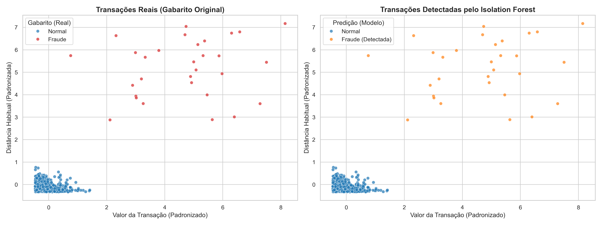

# 🔍 Detecção de Anomalias em Transações Bancárias com Python

> Pipeline completo de Machine Learning não supervisionado para identificação de transações financeiras fraudulentas usando **Isolation Forest**.

Este projeto simula um cenário real de segurança em transações de dados de pagamento, gerando dados de transação sintéticos e aplicando técnicas de detecção de anomalias (outliers) sem depender de dados rotulados (históricos de fraude) para o treinamento.

---

## 📋 Sumário
- [Visão Geral](#-visão-geral)
- [Estrutura dos Dados](#-estrutura-dos-dados)
- [O Modelo (Isolation Forest)](#-o-modelo-isolation-forest)
- [Resultados e Métricas](#-resultados-e-métricas)
- [Visualizações](#-visualizações)
- [Estrutura do Projeto](#-estrutura-do-projeto)
- [Como Executar](#-como-executar)

---

## 🎯 Visão Geral
Em sistemas financeiros, a maior parte das transações é legítima (normal), e as fraudes representam apenas uma pequena fração do volume (normalmente menos de 3%). 

Neste projeto, simulamos **5.000 transações** com uma taxa de **3.0% de anomalias** que reproduzem padrões reais de fraude:
1. **Valores Extremos:** Compras com valor muito acima do perfil do cliente.
2. **Horários Atípicos:** Transações concentradas na madrugada (entre 00h e 06h).
3. **Distâncias Geográficas Incomuns:** Transações realizadas fisicamente longe da residência do cliente.
4. **Novo Dispositivo:** Compras efetuadas através de aparelhos nunca usados anteriormente pelo cliente.

---

## 📊 Estrutura dos Dados
As variáveis geradas para cada transação e utilizadas no modelo são:
* `valor`: Valor monetário da transação.
* `hora_dia`: Horário em que a transação foi realizada (0 a 23).
* `distancia_habitual`: Distância do local da transação em relação à residência (em km).
* `dispositivo_novo`: Variável binária (1 se dispositivo novo, 0 caso contrário).
* `is_anomalia`: Nosso gabarito (usado exclusivamente na validação).

---

## 🤖 O Modelo (Isolation Forest)
O algoritmo **Isolation Forest** é uma técnica não supervisionada que funciona construindo árvores de decisão aleatórias sobre os dados.
* Como anomalias são pontos raros e distantes no espaço de características, elas exigem **menos cortes (partições)** para serem isoladas do restante dos dados legítimos.
* O algoritmo calcula um score de anomalia baseado na profundidade necessária para isolar cada ponto.

---

## 📈 Resultados e Métricas
O modelo obteve desempenho ideal na detecção no conjunto de testes de 1.000 amostras (contendo 30 anomalias reais):

| Métrica | Desempenho |
| :--- | :---: |
| **Precisão (Precision)** | 100% |
| **Recall (Sensibilidade)** | 100% |
| **F1-Score** | 1.00 |
| **AUC-ROC** | 1.0000 |

* **Falsos Positivos:** 0 (nenhuma transação legítima foi classificada incorretamente como fraude).
* **Falsos Negativos:** 0 (todas as fraudes foram detectadas com sucesso).

---

## 🖼️ Visualizações
Abaixo estão os gráficos comparando a classificação original dos dados (gabarito) com o resultado previsto pelo modelo:



---

## 📁 Estrutura do Projeto
```
deteccao_anomalias/
│
├── dados/
│   └── transacoes.csv        # Dataset gerado contendo as transações
│
├── deteccao_anomalias/
│   ├── data_generator.py      # Script gerador de dados sintéticos
│   ├── preprocessor.py        # Análise exploratória e normalização
│   ├── models.py              # Classe do Isolation Forest e avaliações
│   └── main.py                # Pipeline orquestrador e gerador de gráficos
│
├── outputs/
│   └── deteccao_anomalias.png # Gráfico final gerado
│
└── README.md                  # Apresentação do projeto (este arquivo)
```

---

## ⚙️ Como Executar

### Pré-requisitos
Certifique-se de possuir Python 3 e as bibliotecas científicas instaladas:
```bash
pip install pandas numpy scikit-learn matplotlib seaborn
```

### Execução do Pipeline
Para gerar os dados, treinar o Isolation Forest e gerar as visualizações automaticamente, execute o arquivo central:
```bash
python deteccao_anomalias/main.py
```